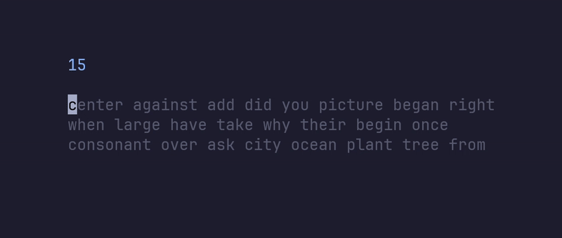

<h1 align="center">typtea</h1>

<div align="center">
<p>
<a href="https://github.com/ashish0kumar/typtea/stargazers"><a>&nbsp;&nbsp;
<a href="https://github.com/ashish0kumar/typtea/"></a>&nbsp;&nbsp;
<a href="https://github.com/ashish0kumar/typtea/releases"></a>&nbsp;&nbsp;
<a href="https://github.com/ashish0kumar/typtea/blob/main/LICENSE"></a>&nbsp;&nbsp;
</p>
</div>

<p align="center">Minimal terminal-based typing speed test with support for dozens of programming languages</p>

<br>
<div align="center">

</div>

---

## Features

- **Terminal-based typing** with WPM and accuracy tracking
- **Multi-language support** including English and 30+ programming languages
- **Infinite word generation** with smooth 3-line scrolling display
- **Minimalist TUI** built with Bubble Tea and Lipgloss
- **Embedded language data** for easy distribution
- **Accurate metrics** following standard typing test calculations

### Supported Languages

| | | | |
|-----------|-----------|-----------|-----------|
| Bash      | C         | C++       | C#        |
| Crystal   | CSS       | Emacs     | English 1k|
| Erlang    | Go        | Haskell   | HTML      |
| Java      | JavaScript| JSON      | Julia     |
| Lisp      | Lua       | OCaml     | Perl      |
| PHP       | PowerShell| Python    | R         |
| Ruby      | Rust      | SCSS      | SQL       |
| Swift     | TeX       | TypeScript| Vala      |
| Vimscript | Wolfram   | YAML      | Zig       |
| | | | |

---

## Installation

### Arch Linux (AUR)

```bash
yay -S typtea
```

### Via `go install`

```bash
go install github.com/ashish0kumar/typtea@latest
```

### Build from Source

```bash
git clone --depth=1 https://github.com/ashish0kumar/typtea
cd typtea/
go build
sudo mv typtea /usr/local/bin/
typtea -h
```

---

## Usage

### Basic Commands

```yaml
# Start a 30-second English typing test (default)
typtea start

# Start a 60-second typing test
typtea start --duration 60

# Start a Rust keywords typing test
typtea start --lang rust

# Combine duration and language
typtea start --duration 45 --lang javascript

# List all available languages
typtea start --list-langs

# Get help
typtea --help
typtea start --help
```

### During the Test

- **The test starts** when you begin typing
- **Backspace** to correct mistakes
- **Enter** to restart after completion
- **Esc** to quit the application

---

## Development

### Prerequisites

[Go 1.19+](https://go.dev/doc/install)

### Setup

```bash
git clone https://github.com/ashish0kumar/typtea.git
cd typtea
go mod tidy
go build
./typtea start
```

### Adding New Languages

1. Create a `JSON` file in `internal/game/data/` with the format:

```json
{
  "name": "Language Name",
  "words": ["word1", "word2", "word3", ...]
}
```

2. Rebuild the application to embed the new language data

---

## Community Extensions

Looking for persistent stats or a database-backed version of typtea?

Check out [PR #1: Database for storing stats](https://github.com/ashish0kumar/typtea/pull/1), which adds SQLite-based session tracking and best-score display.  
This feature is not in the main branch to keep typtea minimal, but you can use it if you want to track your typing history.

## Contributing

Contributions are always welcome! If you have ideas, bug reports, or want to submit code, please feel free to open an issue or a pull request.

## Dependencies

- [**Bubble Tea**](https://github.com/charmbracelet/bubbletea) - TUI framework
- [**Lipgloss**](https://github.com/charmbracelet/lipgloss) - Styling and layout
- [**Cobra**](https://github.com/spf13/cobra) - CLI framework

## License

[MIT License](LICENSE)

<br><br>

<p align="center">
	
</p>
